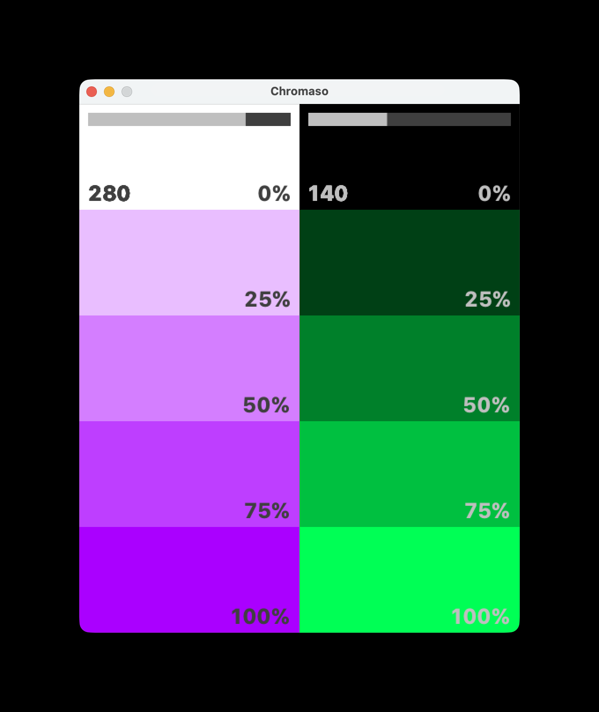

# Chromaso

Chromaso is a Processing sketch that visualizes color hue, saturation, and brightness using interactive sliders. It creates a dynamic color palette that updates in real-time as you adjust the sliders.

## Features

- Interactive sliders for adjusting hue, saturation, and brightness
- Real-time color visualization
- Click any swatch to copy its HEX value to the clipboard
- Brief on-screen confirmation toast showing the copied value
- Ability to save color palettes as images

## Installation

1. Install Processing from [processing.org](https://processing.org/download/)
2. Clone this repository or download the ZIP file and extract it
3. Open the "Chromaso.pde" file in Processing

## Dependencies

This project requires the ControlP5 library. To install it:

1. In Processing, go to Sketch > Import Library > Add Library
2. Search for "ControlP5"
3. Click on ControlP5 and then "Install"

### Font Requirement

This application uses **SF Compact Text**, Apple's special typeface family. You'll need to download and install it:

1. Visit [Apple's Fonts for Developers page](https://developer.apple.com/fonts/)
2. Download the SF Compact font package
3. Install the font on your system
4. Restart Processing if it's already running

Note: SF Compact Text is free to use and available from Apple's website.

## Usage

1. Run the sketch in Processing
2. Use the sliders to adjust the hue, saturation, and brightness values
3. The color palettes will update in real-time
4. Press **S** to save the current color palette as a PNG to `~/Chromaso/`
5. Click any swatch to copy its HEX colour value to the clipboard

## License

This project is licensed under the MIT License – see the [LICENSE](LICENSE) file for details.
